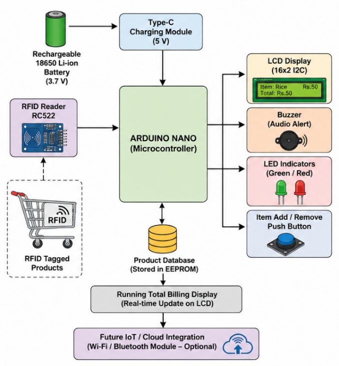
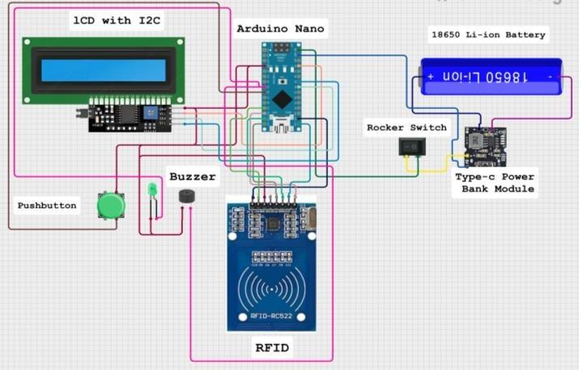
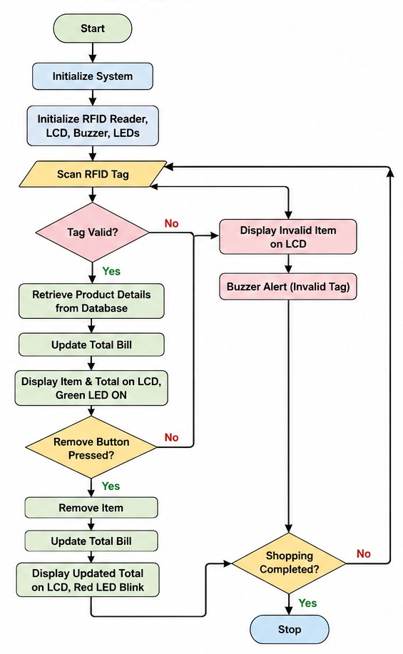
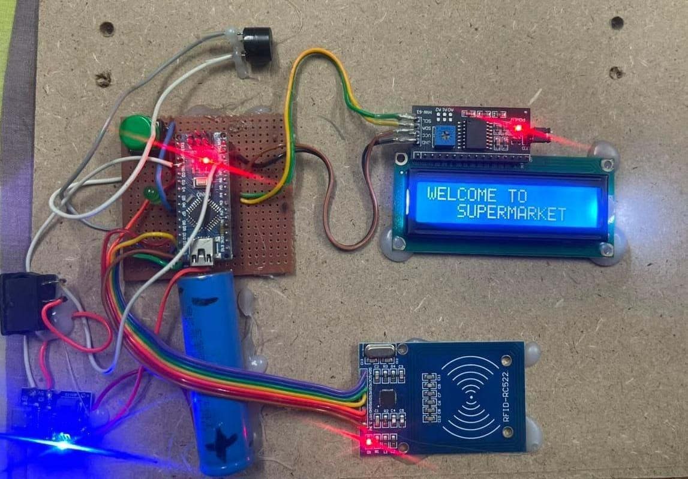
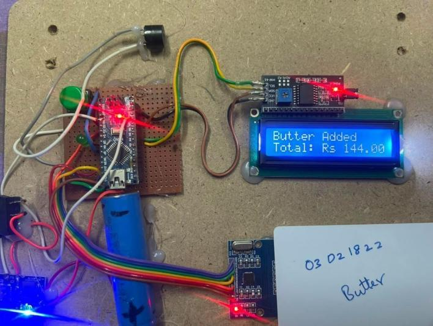
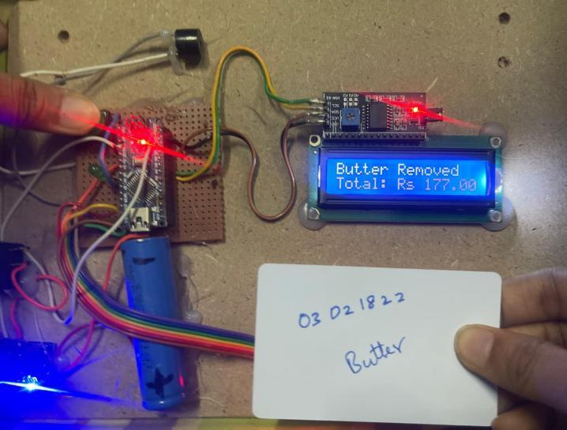

# Smart Shopping Trolley with Automated Billing

### Embedded Systems • RFID • Low-Power Design • Real-Time Billing • Retail Automation

> **A self-contained, battery-operated RFID smart trolley that identifies products and calculates the running bill locally while the customer shops—reducing dependence on conventional checkout counters.**

---

## 📄 Research Publication

**Khatija Mahveen**, Neeraja B., and Dr. T. Nagalaxmi.
*“Design and Implementation of a Low-Power RFID-Based Smart Shopping Trolley with Real-Time Automated Billing.”*

**Submitted:** August 2026
**Conference:** 1st International Emerging Research and Technology Conference (INERTCON 2026)

---

## 🔍 Problem & Proposed Solution

Traditional barcode-based checkout requires line-of-sight scanning and a separate billing stage, resulting in queues and potential errors in product identification, counting, and price entry.

This project moves the billing process **into the trolley itself**.

Passive RFID tags are detected by an onboard reader as products are placed in the cart. The Arduino locally identifies the product, retrieves its stored price, updates the bill, and displays the result in real time.

**Product → RFID → Local Lookup → Bill Calculation → LCD**

The system operates **without Wi-Fi, cloud servers, or external computing infrastructure**.

---

## 🛠️ System Architecture

The prototype is centered around an **Arduino Nano (ATmega328P)**.

| Component                | Function                   |
| ------------------------ | -------------------------- |
| **Arduino Nano**         | Processing & billing logic |
| **MFRC522 RFID**         | Product identification     |
| **16×2 I2C LCD**         | Real-time bill display     |
| **18650 Li-ion Battery** | Portable power             |
| **TP4056 Type-C**        | Battery charging           |
| **Push Button**          | Item-removal control       |
| **Buzzer + LEDs**        | User feedback              |

```text
RFID Tag
   ↓
MFRC522 RFID Reader
   ↓ SPI
Arduino Nano (ATmega328P)
   ↓
Local Product / Price Lookup
   ↓
Bill Calculation
   ↓ I2C
16×2 LCD
   ↓
Buzzer + LED
```

### 📸 Prototype & Design

**System Architecture**



**Circuit Diagram**



**Operational Flowchart**



**Experimental Prototype**



---

## 🧠 Key Innovation — Two-Step Item Removal

To reduce unintended billing changes caused by accidental or repeated RFID scans, item removal requires **explicit user intent**.

### Removal sequence

```text
Remove Button Pressed
        ↓
   Removal Mode
        ↓
Re-scan Same RFID Tag
        ↓
   Remove Item
        ↓
   Update Bill
```

A normal RFID scan therefore **adds** an item, while removal requires the additional button-confirmation step.

### User Operation

**Initialization**


**Product Addition**



**Product Removal**



---

## 📊 Experimental Results

The prototype was evaluated using:

* **50 unique RFID tags**
* **500 total scan attempts**
* Varying tag angles and distances
* Manual billing verification for baskets containing **3–15 items**

### Key Results

| Metric                      |           Proposed System |
| --------------------------- | ------------------------: |
| **RFID Detection Accuracy** |       **99.6% (498/500)** |
| **Billing Accuracy**        |                 **99.8%** |
| **Checkout Time Reduction** | **77.5% (8.0 → 1.8 min)** |
| **Power Consumption**       |                 **65 mA** |
| **Battery Runtime**         |              **~8 hours** |
| **Battery Capacity**        |              **2600 mAh** |

### Performance Comparison

| Parameter         | Conventional | Existing RFID |    Proposed |
| ----------------- | -----------: | ------------: | ----------: |
| Checkout Time     |      8.0 min |       4.0 min | **1.8 min** |
| Billing Accuracy  |        95.2% |         98.4% |   **99.8%** |
| RFID Detection    |            — |         98.9% |   **99.6%** |
| Power Consumption |            — |         90 mA |   **65 mA** |
| Battery Operation |           No |       Limited |     **Yes** |
| Item Removal      |       Manual |            No |     **Yes** |

---

## 🎓 Research Contributions

This project demonstrates:

* **Edge computing** through completely local billing
* **Real-time embedded processing**
* **RFID-based product identification**
* **SPI communication** with the RFID reader
* **I2C communication** with the LCD
* **EEPROM/local product-price storage**
* **Low-power battery operation**
* **Fault-tolerant user interaction** through two-step removal
* Quantitative validation using **500 scan attempts**

The prototype achieved **99.6% RFID detection accuracy**, **99.8% billing accuracy**, and a measured **77.5% reduction in checkout time**.

---

## 🔧 Technologies

**Hardware:** Arduino Nano • ATmega328P • MFRC522 • 13.56 MHz RFID Tags • 16×2 LCD • 18650 Li-ion • TP4056 • Buzzer • LEDs

**Protocols:** SPI • I2C

**Software:** Embedded C/C++ • Arduino IDE • EEPROM

---

## 🚀 Future Scope

The prototype can be extended toward a complete cashier-less retail platform through:

* **Wi-Fi/Bluetooth** for inventory synchronization
* **UPI / QR / NFC** for digital payments
* **Centralized trolley monitoring**
* **Weight sensors** for additional item verification
* **Lightweight computer vision** for sensor fusion
* **Cloud/store analytics** for fleet management

---

## 🔐 Research Disclosure

This repository contains the **engineering architecture, implementation approach, and quantitative performance results** of the prototype.

Confidential, proprietary, unpublished, or institution-restricted material is intentionally excluded.

---

## 🧑‍💻 Author

### **Khatija Mahveen**

**M.E. Embedded Systems & IoT | PhD Aspirant**
**Research Intern — DRDO, Research Centre Imarat (RCI)**

> *From product identification to bill generation—make checkout happen while you shop.*

---

## 📜 License

This project is licensed for **academic and research purposes**.
